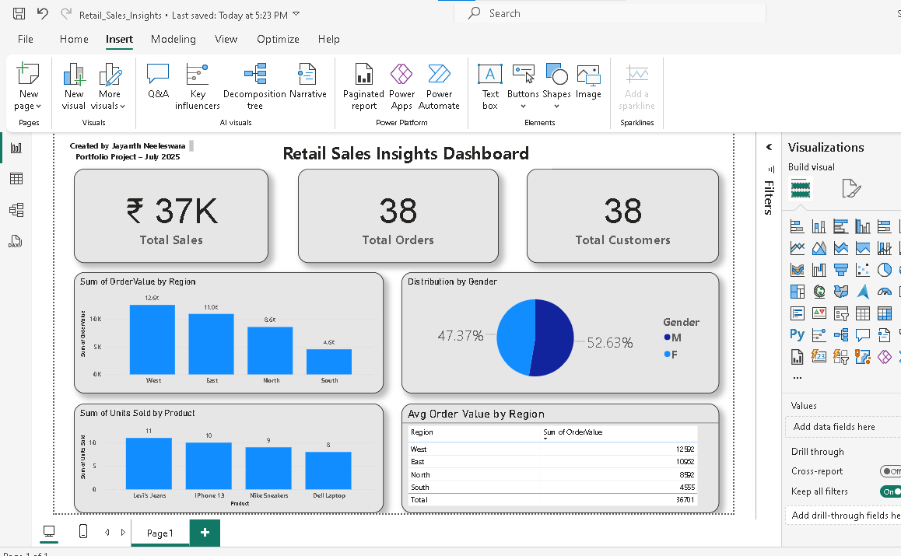

# 🛍️ Retail Sales Insights Dashboard

This project analyzes retail sales data using **SQL** for data processing and **Power BI** for visualization. It helps identify top-selling products, regional performance, and customer demographics.

---

## 📊 Dashboard Preview

 

---

## 📊 Key Performance Indicators (KPIs)

This dashboard tracks key retail metrics to give quick insights into performance:

| 📌 Metric                | Value              | Insight                                                                 |
|--------------------------|--------------------|-------------------------------------------------------------------------|
| 💰 **Total Sales**        | ₹37K               | Total revenue generated from all customer orders.                       |
| 📦 **Total Orders**       | 38                 | Number of orders placed.                                                |
| 👥 **Total Customers**    | 38                 | Number of unique customers. (1:1 ratio with orders)                     |
| 🌍 **Top Region by Sales**| West (₹12.5K)      | West region leads in order value.                                       |
| 🏆 **Top Product Sold**   | Levi’s Jeans (11 units) | Best-selling item by volume.                                      |
| 📊 **Gender Distribution**| 52.63% Female, 47.37% Male | Balanced customer base.                                        |
| 📈 **Avg Order Value by Region** | West: ₹12.5K  
East: ₹11.0K  
North: ₹8.6K  
South: ₹4.6K | Shows regional buying power. |

## 🔧 Tools Used
- **SQL** (data cleaning & analysis)
- **Power BI** (data visualization)
- **Excel/CSV** (dataset format)

---

## 📌 Business Insights
- Total sales by region
- Top 5 best-selling products
- Customer distribution by gender
- Average order value by region

---

## 📁 Files Included
- `Retail_Sales_Insights.pbix` – Power BI dashboard file
- `dashboard_screenshot.png` – Dashboard preview
- CSV data files (optional)

---

## 🌐 Live Dashboard
[👉 View on Power BI (Public Link)](Retail_Sales_Insights.pbix)

---

## 👤 Author
**Jayanth Neeleswara**  
_Data Analyst Portfolio Project (July 2025)_

